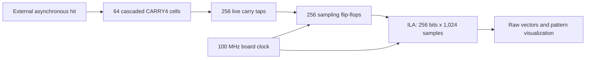

# FPGA Carry-Chain Delay-Line Capture

**A 256-tap asynchronous edge-capture prototype implemented in SystemVerilog on a Basys 3 Artix-7 FPGA.**

`SystemVerilog` · `AMD Vivado` · `Artix-7` · `CARRY4` · `ILA` · `Hardware debugging`

This project uses the FPGA's dedicated carry chain as a tapped delay line. An external electrical edge propagates through 64 CARRY4 primitives; 256 flip-flops sample its spatial state on the same 100 MHz clock edge. Vivado's Integrated Logic Analyzer (ILA) exposes the captured vectors for inspection.

The hardware demonstration produced mixed tap patterns with boundaries at different positions along the line. It shows the practical connection between structural RTL, physical FPGA resources and bench measurements.

*Existing hardware-result figure: eight selected mixed samples from a 1,024-sample acquisition. Yellow is logic 1; purple is logic 0. The row labels retain the original sample indices. These are tap states, not calibrated time values.*

## At a glance

| Item | Implementation |
|---|---|
| Board | Digilent Basys 3 |
| FPGA | Artix-7 `xc7a35tcpg236-1` |
| RTL | SystemVerilog, top module `tdl_capture` |
| Delay line | 64 cascaded CARRY4 primitives; 256 carry outputs |
| Sampling | 256 registers, nominal 100 MHz clock / 10 ns period |
| Debug | One 256-bit ILA probe, depth 1,024 |
| Input | External asynchronous signal on Pmod JA1 / package pin J1 |
| Tool version | Vivado 2024.1 in the source project's metadata |
| Demonstration | Signal-generator stimulus, ILA capture and raw-pattern visualization |

## Architecture

The delay line evolves continuously. The sampling bank records its state at each rising clock edge. The ILA observes the registered vector through a separate clocked debug path; its displayed row must be interpreted with that sampling relationship in mind.

## Hardware result

The September 2026 hardware record describes one acquisition containing eight mixed vectors: seven with a single boundary and one with three transitions. The clean displayed boundaries occur near taps 19, 39, 87, 107, 141, 167 and 231. Both spatial boundary orientations appear.

The result supports **qualitative physical delay-line capture**. The irregular vector is retained rather than hidden: it is useful evidence that raw hardware patterns do not always match an ideal thermometer code.

Full-period coverage, bin widths, timing precision, linearity and event acceptance were not measured by this demonstration. The original full CSV and plotting script are not included, so the historical figure has not been independently regenerated from raw data in this repository. See the [hardware evidence and interpretation](docs/results.md).

## Engineering skills demonstrated

- Structural SystemVerilog: vendor primitives, generate loops and indexed vector slices.
- Sequential design: a parallel sampling register bank using `always_ff` and nonblocking assignments.
- FPGA implementation: connecting RTL to dedicated carry resources and inspecting physical placement.
- Constraints and debug: board pin/clock definitions, signal-preservation attributes and ILA integration.
- Bench investigation: applying electrical stimulus, capturing internal signals and interpreting non-ideal patterns.
- Technical documentation: separating the observed result from unmeasured performance claims.

## Explore the project

| File | Purpose |
|---|---|
| [`rtl/tdl_capture.sv`](rtl/tdl_capture.sv) | Preserved implementation source |
| [`constraints/basys3_tdc.xdc`](constraints/basys3_tdc.xdc) | Preserved board and debug constraints |
| [`scripts/create_project.tcl`](scripts/create_project.tcl) | Creates a fresh Vivado project from the included files |
| [Design walkthrough](docs/design.md) | How the actual RTL becomes the capture hardware |
| [Project setup and hardware use](docs/hardware.md) | Setup, debug configuration and build checks |
| [Results and evidence](docs/results.md) | Acquisition settings, figures, observations and limitations |
| [`docs/source-checksums.json`](docs/source-checksums.json) | SHA-256 identities of preserved source and figures |

The project-creation script was added for repository setup and has not been run through synthesis or hardware validation. The included source and constraints preserve the located prototype; their exact correspondence to the historical acquisition remains unconfirmed.

**Author:** [Majed Alharbi](https://github.com/DevMajed)
