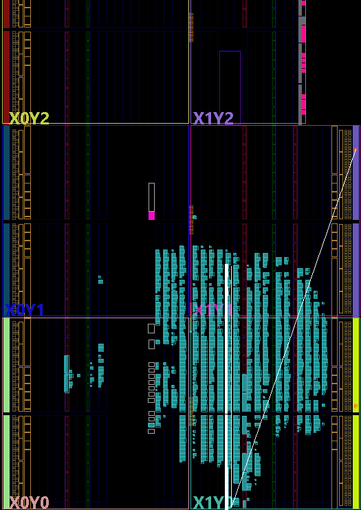

# Design walkthrough

## Turning an edge into a spatial pattern

A tapped delay line exposes an edge at several points along a propagation path. Sampling all those points together can show how far the edge has travelled at that sampling instant. A clean capture often has one boundary between two logic levels. Its position is a raw spatial observation; converting it into a physical time requires a separate measurement and calibration.

This implementation deliberately exposes the raw hardware behavior. Its top-level ports are `clk` and `hit`; the useful observation is the internal debug-marked `raw_taps` vector.

## Carry-chain structure

The source defines:

```systemverilog
localparam int NUM_CARRY = 64;
localparam int NUM_TAPS  = NUM_CARRY * 4;
```

Each CARRY4 exposes four carry outputs, giving 256 taps in the elaborated design. The first instance connects `hit` to `CYINIT`, ties `CI` low, sets `S` to `4'b1111` and `DI` to `4'b0000`, and connects `CO` to `carry_taps[3:0]`. The arithmetic `O` outputs are unused.

With the select inputs held high, the carry stages propagate the chain input. Later CARRY4 instances take the preceding block's final carry output through `CI`; their `CYINIT` inputs are low. The dedicated cascade connects the blocks into one physical path. AMD describes these resources in [UG474: Carry Logic](https://docs.amd.com/r/en-US/ug474_7Series_CLB/Carry-Logic).

The generate loop elaborates 63 additional instances:

```systemverilog
.CI (carry_taps[(4*i)-1]),
.CO (carry_taps[(4*i) +: 4])
```

For `i=1`, the input is tap 3 and the outputs are taps 4 through 7. For `i=63`, the input is tap 251 and the outputs are taps 252 through 255. The `+: 4` syntax selects four bits starting at the stated index. This loop describes repeated hardware; it is not a software loop running during acquisition.

## Sampling bank

```systemverilog
always_ff @(posedge clk) begin
    raw_taps <= carry_taps;
end
```

This describes 256 parallel sampling registers. `carry_taps` changes as the asynchronous input propagates; `raw_taps` updates at a rising clock edge. The nonblocking assignment describes the clocked update.

The input intentionally enters the carry path asynchronously. Sampling near an edge can produce uncertain or irregular states; this circuit does not establish that every captured vector represents a valid timestamp. A multi-boundary vector alone also does not identify its physical cause.

## Preservation and ILA

The RTL marks the carry vector with `keep` and `dont_touch`. The sampled vector additionally uses `mark_debug`. These attributes preserve observability through the implementation flow; they do not specify measured delays or fixed slice coordinates.

The ILA is configured through the XDC, rather than instantiated in the source module. Its probe is wired explicitly to `raw_taps[0]` through `raw_taps[255]`; the ILA and sampling bank use the board clock. `C_INPUT_PIPE_STAGES=0` disables optional extra probe stages. It does not eliminate the sampling registers or make the ILA asynchronous. See [UG908: Debug Core Properties](https://docs.amd.com/r/2024.1-English/ug908-vivado-programming-debugging/Modifying-Properties-on-the-Debug-Cores).

The debug observer and sampling bank are separate sequential elements. When interpreting ILA rows, establish which registered sample each row represents, and verify the exported vector's bit order.

## Physical implementation

The hardware record describes a continuous carry chain at `SLICE_X45Y0` through `SLICE_X45Y63` after ILA insertion, with sampling flip-flops colocated along it. The included XDC does not contain explicit `LOC` or `BEL` placement constraints, so those coordinates are an observation of a particular implementation, not a placement guarantee for a new build.



*Device-view screenshot retained from the hardware work. Rebuilding requires a new placement inspection; this image does not establish a delay value.*

Clock constraints describe the sampling clock. They do not calibrate the asynchronous carry path. Ordinary functional simulation likewise does not establish device-specific tap delays, timing precision or the frequency of irregular captures.

The source has no encoder, coarse counter or timestamp output. Its implemented function is raw delay-line capture.
