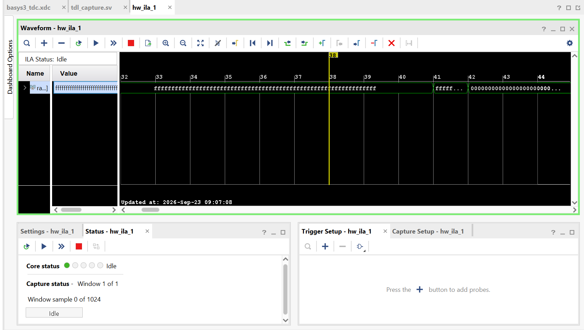
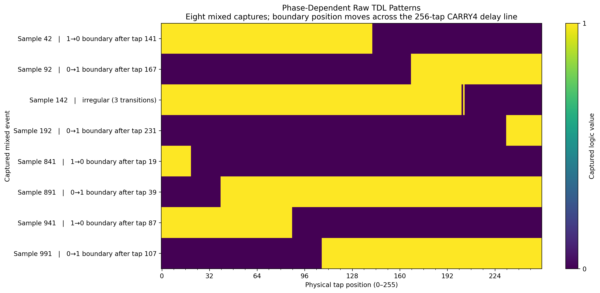

# Hardware evidence and interpretation

## Demonstration settings

The available September 2026 hardware record describes:

| Item | Recorded setting / observation |
|---|---|
| Platform | Basys 3 Artix-7 |
| Carry chain | 64 CARRY4 cells, 256 sampled taps |
| Sampling clock | Nominal 100 MHz |
| Debug acquisition | 256-bit ILA probe; 1,024 samples |
| Stimulus | Siglent SDG1032X square wave, 1.001 MHz |
| Source levels | 0-3 V, 50% duty cycle, Hi-Z setting; oscilloscope checked |
| Post-ILA placement | Reported `SLICE_X45Y0` through `SLICE_X45Y63` |
| Mixed patterns | Eight selected rows: seven single-boundary, one with three transitions |

The record is dated 23 September 2026; a separate exact acquisition timestamp and complete capture metadata have not been recovered here. The placement and acquisition observations are taken from the existing hardware record rather than a new build or experiment.

*ILA screenshot retained from the demonstration. The vector is observed through a clocked debug path.*

## Selected mixed patterns

| Original sample index | Displayed spatial pattern | Approximate boundary after tap |
|---|---|---|
| 42 | Single, 1 to 0 | 141 |
| 92 | Single, 0 to 1 | 167 |
| 142 | Irregular, three transitions | No unique clean boundary assigned |
| 192 | Single, 0 to 1 | 231 |
| 841 | Single, 1 to 0 | 19 |
| 891 | Single, 0 to 1 | 39 |
| 941 | Single, 1 to 0 | 87 |
| 991 | Single, 0 to 1 | 107 |

The table is transcribed from the existing record and figure, not recomputed from a recovered CSV. The displayed rows are selected mixed samples, not eight consecutive events. A spatial 1-to-0 or 0-to-1 boundary is not automatically the temporal input-edge polarity; that interpretation requires a verified tap/export ordering convention.

## What the result supports

The physical implementation produced non-settled tap vectors with boundaries at several positions. Together with placement inspection and ILA observation, this supports qualitative operation of a carry-chain capture prototype.

The irregular vector remains part of the evidence. Its cause is unresolved: sampling behavior, ordering, skew and physical effects require investigation. It is not sufficient evidence to attribute the anomaly specifically to metastability.

## Limits of the evidence

- The eight selected mixed rows do not establish an event-acceptance efficiency or a population irregular-pattern rate.
- A 10 ns clock period does not establish that the 256-tap chain covers the complete period.
- Tap count and boundary positions do not establish calibrated bin width, resolution, timing precision, DNL or INL.
- Both settled endpoints need interpretation. The historical disconnected-input observation was all ones; settled vectors alone do not establish valid input events.
- Rate capability and valid timestamps were not evaluated by this raw-capture demonstration.

The original 1,024-row CSV and the historical plotting script were not found in the available project inventory. The image is therefore included as an existing result figure, not a newly reproducible analysis artifact. The exact correspondence between the preserved source files and the measured bitstream remains unconfirmed.

## Source preservation

The implementation RTL and XDC were copied without content changes from the located prototype. The three PNG figures were copied without altering their pixel content or labels. Their SHA-256 identities are recorded in [`source-checksums.json`](source-checksums.json).

Documentation and the project-creation script were prepared on 3 October 2026. This packaging did not produce a new synthesis result, physical placement or hardware measurement.
